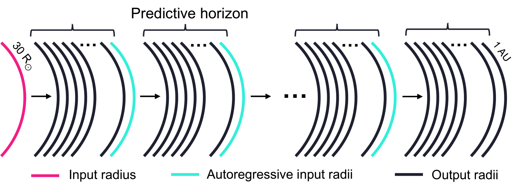

# Autoregressive Surrogate Modeling of the Solar Wind with Spherical Fourier Neural Operator

This repository contains the official implementation of the paper  
**"Autoregressive Surrogate Modeling of the Solar Wind with Spherical Fourier Neural Operator"**.

We utilize the **Spherical Fourier Neural Operator (SFNO)** as a novel data-driven surrogate model for simulating the **radial velocity of the solar wind** on spherical shells. Unlike traditional models like HUX that rely on empirical acceleration terms, SFNO learns directly from data in the spectral domain on spherical geometries—enabling faster, scalable, and flexible forecasts.

In addition to the base model, we propose an **autoregressive variation** of SFNO: it predicts the solar wind velocity across 5 radial shells (channels) at a time and recursively uses the last predicted shell as input to forecast the next 5, continuing until all 139 radial shells are predicted. This approach allows the model to generate full 3D radial profiles with a compact architecture.

---

## Highlights

- **Data-driven surrogate modeling** of solar wind radial velocity using spherical spectral operators.
- **First application of SFNO** in heliophysics for global-scale predictions.
- **Autoregressive variation** enables forecasting across all 139 radial shells using iterative 5-radius predictions.
  
- **5-radius SFNO model** achieves the best overall performance across accuracy metrics.
- **Outperforms or matches** traditional physics-based models like HUX-f across multiple test cases.
- Demonstrates potential for **real-time and efficient space weather prediction pipelines**.

---

## Visual Inspection

Below are representative SFNO predictions of solar wind radial velocity for different Carrington rotations:

- **CR2228** — Easiest case for SFNO (Based on MSE)
  

- **CR2268** — Typical performance  
  

- **CR2293** — Hardest case for SFNO (Based on MSE)
  

---

## Getting Started

Install dependencies from `requirements.txt`:

```bash
pip install -r requirements.txt
```